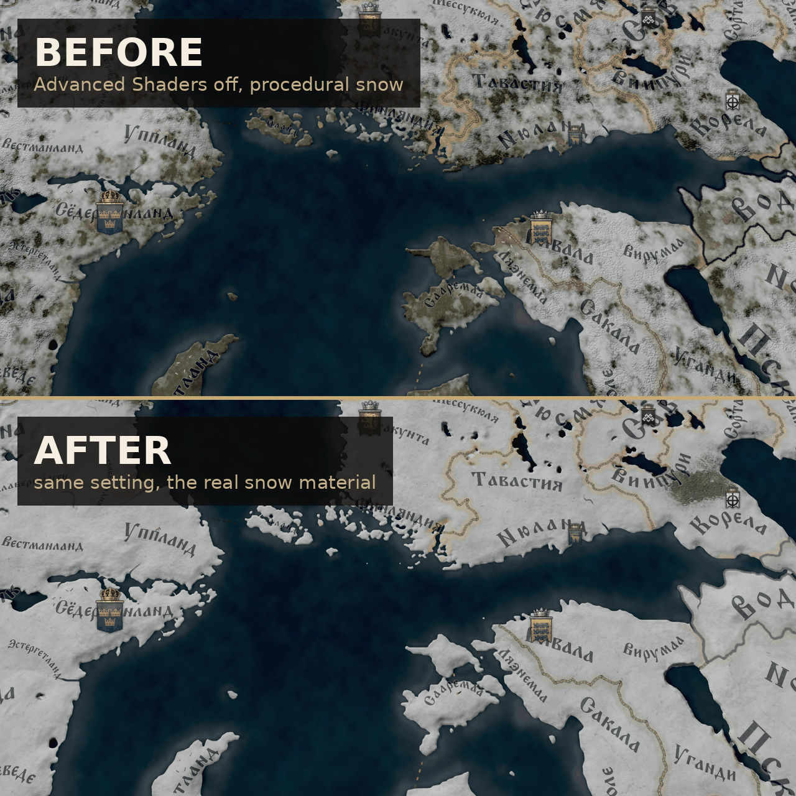

# Real Snow Without Advanced Shaders (CK3)

Дополнение к [Sharp Terrain Without Advanced Shaders](https://github.com/mekedron/ck3-lowspec-terrain-fix),
которое возвращает карте настоящий снег при выключенной настройке **«Дополнительные
эффекты шейдеров»**. Ванильный low-spec рисует снег плоским процедурным пятнистым
узором; с этим дополнением шейдер ландшафта запускает тот же *материал* снега, что и
high-spec путь: сплошной покров со своим смешиванием по высоте, картой нормалей,
шероховатостью и слоем инея.

## Как это работает

Весь мод — один файл `gfx/FX/sharp_terrain_options.fxh`, в котором

    #define TERRAINOPT_SNOW_MATERIAL

`pdxterrain.shader` из Sharp Terrain подключает файл с таким именем первым и несёт код
материала снега за этим define, в базовом моде выключенным. Игра резолвит include по
пути через все включённые моды, побеждает нижний в порядке загрузки, так что эта копия
подменяет файл опций базового мода, и опция включается. Шейдер не дублируется, базовый
мод обновляется независимо.

Требует Sharp Terrain Without Advanced Shaders **выше** этого мода в порядке загрузки.
Сам по себе файл никем не читается, и мод ничего не делает.

## Что делает опция

С выключенной настройкой пиксельный шейдер ландшафта обычно вызывает
`ApplyDynamicMasksDiffuse()` → `ApplySnowDiffuse()` (`game/gfx/FX/dynamic_masks.fxh`):
три выборки диффуза снега, наложенные в маску, порог по суровости зимы в провинции и
краска поверх земли. С опцией Sharp Terrain вызывает `ApplySnowMaterialTerrain()`,
high-spec путь, который вмешивает материал снега в per-pixel высоту, нормаль и материал
деталей: снег получает свой рельеф и блеск, плюс слой инея по краям.

## Цена

Около **4 мс на кадр** там, где снег возможен; замерено на RTX 3050 Ti Laptop (4 ГБ)
при 5120x1440 в январе. Там, где маска говорит «снега не бывает», шейдер выходит после
одной выборки. На той машине low-spec 60 FPS с vsync удержались.

## Структура

    descriptor.mod                        метаданные мода
    thumbnail.png                         превью для Workshop, в корне мода
    gfx/FX/sharp_terrain_options.fxh      сам мод
    install.sh                            копирует мод в Proton-префикс
    tools/check_log.sh                    проверка монтирования после запуска
    steam-workshop/                       тексты для листинга и генератор превью

## Установка

Запустите `./install.sh`. Он копирует мод в папку модов CK3 внутри Proton-префикса.
Затем в плейсете лаунчера включите его **ниже** Sharp Terrain Without Advanced
Shaders и держите «Дополнительные эффекты шейдеров» выключенными. Первая загрузка карты
медленнее, пока шейдер пересобирается.

## Версия игры

Собран под 1.19.0.6 (Scribe) и Sharp Terrain 1.1. У файла нет ванильного аналога,
патчи игры его не трогают; тронуть может только релиз Sharp Terrain, переименовавший
опцию.

## Мультиплеер / достижения

Опции шейдеров не входят в контрольную сумму, но лаунчер всё равно помечает любой мод
как мод. Относитесь к нему как к любому графическому моду.
